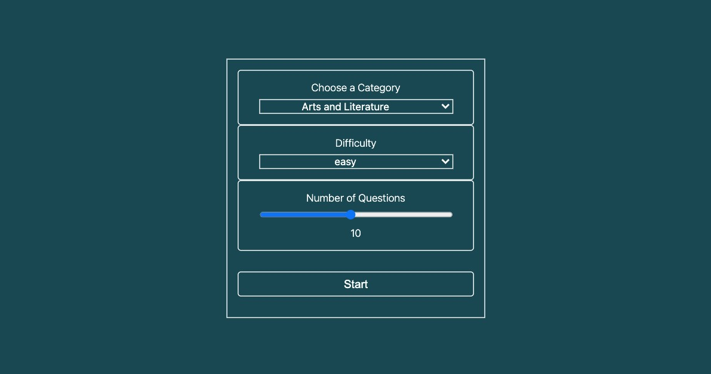

# Quiz App

This is an __App Quiz__.

The user can choose between several categories, difficulty and number of questions. These variables are dynamic and are at the user's discretion. Once the user fills out the questions, the App fetches questions from an API that returns the questions and the alternatives.

Finally, once the user has answered, the App tells the user how many questions he/she answered correctly and which are the correct answers.

A demo is here: [Quiz App](https://quiz-app-git-main-neilchavez.vercel.app/)
